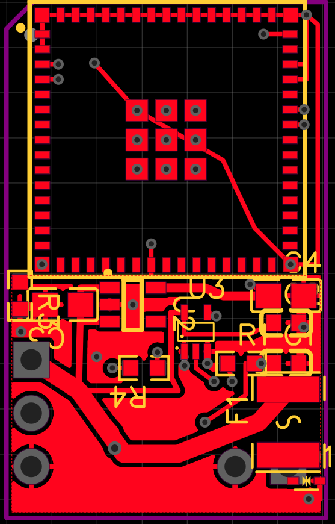
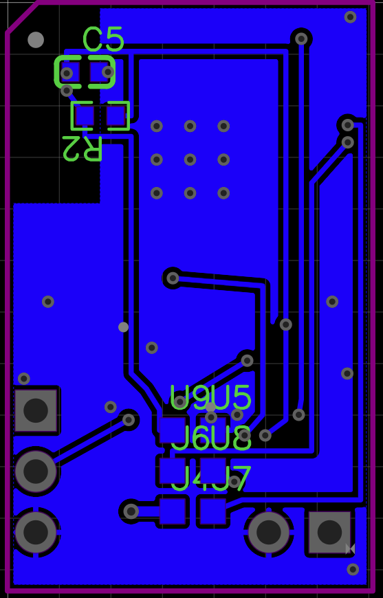

# V2 compact-layout visual review — 2026-07-31

Status: **placement redesign required; not fabrication-ready**

This review records the current compact EasyEDA iteration after the board was reduced from the proven 18 × 32 mm recovery baseline to an experimental 18 × 29 mm layout. The screenshots are evidence for placement review, not manufacturing outputs.

## Captured views

### Top copper and component placement



### Bottom copper and fixture routing



Source screenshots supplied by Carlos from `/home/carlos/Downloads`:

| Repository asset | SHA-256 |
|---|---|
| `top-layer-current.png` | `70fd2277d0291a99aa26a073ffdb57acbd1d6e3ac585d949a73c3e095aa63bc8` |
| `bottom-layer-current.png` | `82470496ad06e79e4b6351402d952187360d08d498568ab213ce76559b3c89b2` |

## Current experimental state represented by the views

- outline: 18 × 29 mm;
- 22 footprints;
- 60 tracks;
- 35 vias;
- two GND copper areas;
- all 11 nets connected;
- fresh EasyEDA DRC result: zero errors;
- five cable holes use 2.00 mm pads and 1.20 mm finished holes;
- the two input holes retain 3.00 mm pitch;
- the input GND and LED-output GND holes share the same Y coordinate;
- six underside programming targets remain 1.20 × 1.20 mm.

These facts do not make the placement mechanically acceptable. EasyEDA permits same-net copper overlap, while a hand-soldered cable landing also needs unobstructed tool, wire, inspection, and strain-relief access.

## Confirmed mechanical problem: input landing and PPTC

Carlos correctly identified that the power-input area looks overlaid by the fuse.

The current deterministic placement puts:

- `J_5V_IN` 5 V hole center at `(4082.500, 3527.811)`;
- `F_VBUS` head at `(4082.500, 3518.000)`, rotated 90°;
- `F_VBUS` raw-input pad center at `(4082.500, 3525.297)`;
- that fuse pad extends approximately from Y `3522.528` through `3528.066`.

The fuse pad therefore enters the 2.00 mm plated-hole landing around the same-net `5V_IN` hole. This is electrically legal and helped produce zero DRC, but it crowds the cable-soldering zone and makes the placement visually and mechanically ambiguous. `D_VBUS` is also packed into the bottom-right connector area, compounding the congestion.

The current 18 × 29 mm routed result should be retained as an experimental recovery point, but this placement should not advance to Gerber generation.

## Recommended big redesign: connector-first horizontal architecture

Do not repair the current placement one marker at a time. Rebuild the lower half around explicit mechanical zones and straight electrical flow.

### 1. Create one five-hole cable row

Rotate/rebuild the LED landing so all five cable holes occupy one horizontal row at the board foot:

```text
LED 5V   LED DATA   LED GND      INPUT GND   INPUT 5V
   o         o          o             o          o
```

A plausible 3.00 mm-pitch source-unit study is:

- LED 5 V: `(4025.500, 3527.811)`;
- LED DATA: `(4037.311, 3527.811)`;
- LED GND: `(4049.122, 3527.811)`;
- input GND: `(4070.689, 3527.811)`;
- input 5 V: `(4082.500, 3527.811)`.

Benefits:

- every pigtail approaches the same enclosure-facing edge;
- no wire must be soldered beside a vertical column of other holes;
- LED GND and input GND can share a clear central ground corridor;
- the protected-5 V trunk can become a deliberate horizontal power spine;
- the current lower-left connector column and its diagonal routes disappear;
- visual pin order becomes obvious during assembly and inspection.

The exact left-to-right order remains provisional until wire colors, enclosure exits, polarity marking, and pigtail handling are reviewed.

### 2. Reserve a real connector courtyard

Create a no-component mechanical band above the cable row. The rule should apply to component bodies and courtyards, not only different-net copper.

At minimum:

- no SMD body or courtyard over any cable-pad annulus;
- no component between a cable hole and the board edge;
- enough room for a soldering-iron tip approaching from either side;
- visible pin labels that do not rely on overlapping reference text;
- enclosure strain relief located beyond the PCB solder joints.

### 3. Rotate the PPTC back into the power-flow direction

Preferred placement concept:

```text
INPUT 5V hole
     |
     | short, wide raw-5V rise
     v
[PPTC input] -- [PPTC body] -- [protected-5V output] ---> leftward 5V spine
```

Place the 1812 PPTC horizontally above the connector courtyard, with its raw-input pad vertically aligned to the input 5 V hole and its protected output facing left. A useful prior study placed the head near `(4075.203, 3515.2)` at 180°; the next pass should test moving it slightly farther upward to improve soldering clearance.

This arrangement is better than the current vertical fuse because:

- the series power path is visually self-explanatory;
- the component body is not over the cable hole;
- raw and protected 5 V occupy opposite sides of the part;
- the protected output naturally launches the leftward LED/LDO/buffer supply spine;
- the wide route no longer needs to fold around the input landing.

### 4. Move the TVS out of the connector row

The TVS should be close to raw input but not consume the wire-access zone. Place it above or upper-right of the input/fuse pair, with:

- a short branch from raw 5 V;
- a short, explicit GND return to a named plane anchor;
- no routing that crosses the protected side of the PPTC;
- sufficient edge and assembly clearance.

A previous geometry study found a candidate around `(4087.8, 3498.4)` at 90°, but the final position must be revalidated against `C_EN`, the right board edge, and the new fuse location.

### 5. Rebuild the component corridor by function

Use three readable bands below the ESP32 module:

1. **low-voltage regulation:** AP2112 and its input/output capacitors grouped tightly on the left;
2. **data path:** AHCT buffer, local decoupling, pull-down, and 33 Ω output resistor grouped in signal-flow order near the LED DATA route;
3. **control/protection:** EN network toward the right, then PPTC/TVS above the input connector.

Reference designators and value text should be moved or reduced after placement so they do not obscure inspection. Silkscreen overlap is not the electrical defect, but the current text density makes real mechanical conflicts harder to see.

## Bottom-side rethink

The bottom view shows that long signal transports and the current 2 × 3 pogo field consume the lower routing aperture.

### Evaluate a 3 × 2 pogo field

A 3-column × 2-row field uses more width but less board height than the current 2-column × 3-row field. Because width is fixed mainly by the ESP32 module while height is the compression target, this may be a better shape.

Do not change it casually. A valid study must:

- preserve all six functions: 5 V, GND, TX, RX, EN, and BOOT;
- preserve 2.00 mm pitch and 1.20 mm targets unless the probe hardware changes;
- reserve probe-body and support-pin clearance, not merely copper-pad clearance;
- keep fixture metal out of the antenna volume;
- regenerate the fixture directly from final PCB coordinates.

Moving the pogo field under the lower portion of the module or into a wider 3 × 2 strip could free approximately one row of vertical layout space, but exposed-pad vias and continuous ground return take priority.

### Route-policy target

- top: raw/protected 5 V, local SMD power, and short local signal escapes;
- bottom: long low-speed transports and pogo landings;
- GND: explicit local returns plus named cross-island anchors;
- no route should be retained merely because it made the previous placement pass DRC.

The current 35-via count is a defensible result for the existing placement, not a sacred target. A true connector-first rearrangement may remove several signal detours, but the nine ESP32 exposed-pad vias and justified return anchors should not be sacrificed for appearance.

## Compression targets

### Recommended next target: 18 × 28 mm study

An 18 × 28 mm board is a credible next study only if the connector row, fuse, TVS, and pogo field are moved as a system. Preserve approximately the current cable-pad edge margin rather than trimming the outline around unchanged holes.

### Do not target width reduction

The ESP32-S3-MINI-1 module already defines nearly all of the 18 mm width. Reducing width would compromise module-pad routing, edge clearance, or antenna mechanics for little product benefit.

### More radical options to investigate separately

- qualify a smaller PPTC package with equivalent hold-current, derating, fault-current, voltage, and trip behavior;
- revise the fixture to a 3 × 2 or edge-oriented probe pattern;
- use a purpose-designed combined cable footprint with clear pin-order silkscreen;
- reconsider component side assignment only if assembly and probe access remain practical.

These are architecture choices, not assumptions to apply to the existing source without electrical and manufacturing review.

## Next implementation gate

Before rerouting again:

1. freeze the current 18 × 29 mm zero-DRC source as an experimental snapshot;
2. define the five-hole row and connector courtyard;
3. place the PPTC, TVS, LDO group, level-shifter group, and pogo field with no copper;
4. run body/courtyard, pad, edge, antenna, and probe-clearance checks;
5. review the placement visually with Carlos;
6. only then rebuild power and signal routes;
7. require complete connectivity, fresh zero DRC, deterministic reruns, save/reopen persistence, and source-derived fixture regeneration.

Zero DRC is necessary. Clear assembly access and intelligible power flow are separate release gates.