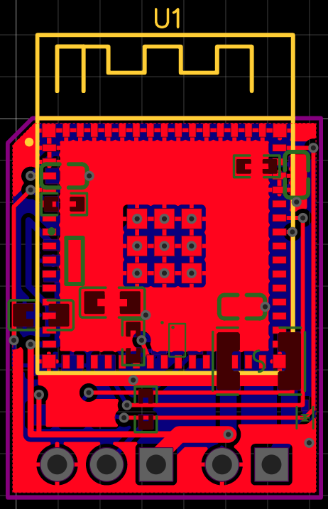

# EasyEDA V2 19 x 23 mm one-side-assembly recovery snapshot - 2026-08-04

This directory captures the current verified `Compact ESP32-S3 USB LED Controller V2` working design after the rejected V3 experiment was scrapped and V2 was restored.

It is a **verified recovery/reference snapshot, not a fabrication release or final visual-layout acceptance**.

## Milestone captured

- 19 x 23 mm outline;
- two copper layers;
- 22 footprints;
- 45 copper tracks plus one board-outline track;
- 28 vias;
- two filled GND copper areas containing five fill polygons;
- all 11 nets connected;
- fresh EasyEDA `DRC Errors (0)`;
- `U_ESP` alone as user-installed top-side SMT;
- 13 ordinary bottom-side SMT footprints for one-side JLC assembly;
- top-side through-hole `J_5V_IN` and `J_LED` pigtail landings for user installation;
- rejected V3 document, placement script, and seed absent;
- canonical V2 project saved clean after restore and rerun.

One-side assembly describes factory component placement, not copper count. This remains a two-layer PCB.

## Contents

- `easyeda/`: byte-identical copies of the current native EasyEDA schematic/project JSON, routed PCB JSON, and `info` metadata.
- `automation/`: current deterministic V2 build, wiring, layer configuration, placement, one-side routing, generated state, and required helper dependency.
- `verification/current-board.png`: Carlos's newly captured combined-layer EasyEDA screenshot. It is visual evidence, not source authority.
- `verification/verification.json`: machine-readable counts, assembly split, hashes, DRC/connectivity evidence, rollback state, and remaining gates.
- `MANIFEST.sha256`: integrity hashes for all snapshot files except the manifest itself.

## Current image

[](verification/current-board.png)

## Authority and limitations

The mutable working sources at capture time were:

```text
/home/carlos/.easyeda/projects/Compact ESP32-S3 USB LED Controller V2/
/home/carlos/.local/share/easyeda-agent-harness/
```

The repository copy is an immutable recovery point. Compare it with the live workspace before any restore; never blindly overwrite newer EasyEDA work.

This snapshot verifies deterministic current state, connectivity, and zero-error EasyEDA DRC. It does not prove electrical correctness, manufacturing readiness, thermal performance, RF behavior, hand-reflow success, or enclosure fit.

Before ordering, complete the release gates listed in `verification/verification.json` and [`../../DESIGN.md`](../../DESIGN.md).
